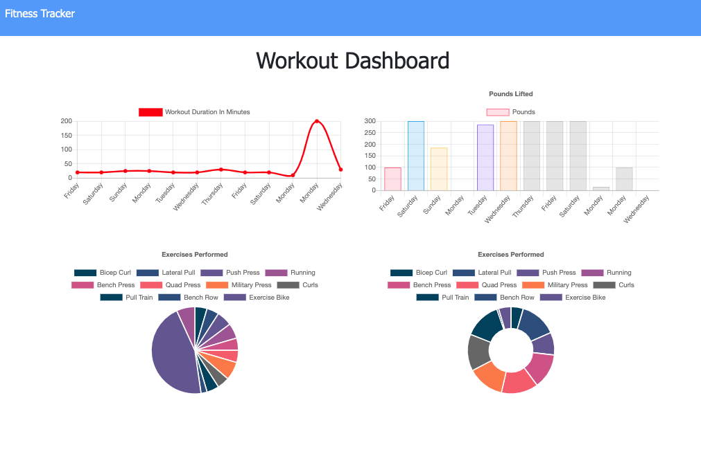

# **Fitness Tracker**

## Description 
With this app you will to be able to view create and track daily workouts. You can also log multiple exercises in a workout on a given day. Keeping track the name, type, weight, sets, reps, and duration of each exercise. If the exercise is a cardio exercise, you can also track the distance traveled
## Screenshots

## Table of contents
- [Description](#Description)
- [License](#License)
- [Repository Link](#Repository)
- [Diployed App Info](#App) 
- [GitHub Info](#GitHub) 
## License
MIT
## Repository
- [Fitness Tracker](https://github.com/Meddle74/fitnessTracker)

## App
- [Fitness Tracker App on Heroku](https://meddle74-fitness-tracker.herokuapp.com/)
## GitHub
- Email: jpatricklloyd@gmail.com
- [GitHub Profile](https://github.com/Meddle74)